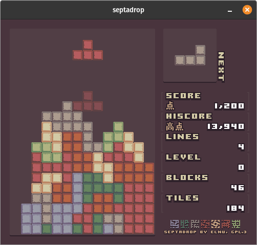

# septadrop

A block game made in C++ and [SFML](https://www.sfml-dev.org/).

For build instructions, see the [build folder](build).

### Acknowledgements

- Graphics are using the [Lost Century 24 Palette](https://lospec.com/palette-list/lost-century-24) by CalmRadish, and are made with the wonderful sprite and pixel art editor [Aseprite](https://github.com/aseprite/aseprite/).
- Text is using [Boxy Bold Font](https://opengameart.org/content/boxy-bold-font) by Clint Bellanger, CC0
- Sound effects are made using [jsfxr](https://github.com/chr15m/jsfxr) by Eric Fredricksen, a JavaScript port of DrPetter's [sfxr](http://www.drpetter.se/project_sfxr.html).
- and last but not least to my friend [CarlyRaeJepsenStan](https://github.com/CarlyRaeJepsenStan) for feedback and playtesting.